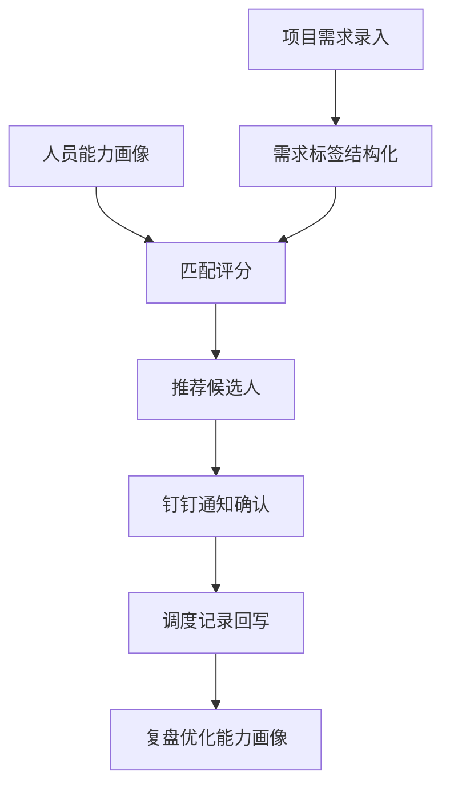

# Idea Exploration

## 目标

把用户的一句模糊想法变成可讨论、可判断、可沉淀的需求雏形。先建立专业视角，再把“我只是想做一个工具”的一，扩展成“未来能形成产品能力”的二，最后决定是否进入 PRD、Wiki 沉淀或 AI coding 执行。

这不是纯追问 skill。它要主动补充产品、业务、技术、数据、组织和风险视角，只在关键缺口上追问一个问题。追问时借鉴 `grill-me` 思路：沿设计树逐个锁决策，每个问题都给推荐答案；如果能通过现有 Wiki、仓库或资料判断，就先查证，不把问题甩回用户。

## 适用场景

- 用户说“我有个想法”“帮我扩展一下”“AI 能不能做”“这个能不能用 AI coding 做”。
- 用户只有一个点状需求，例如数据看板、统计工具、智能调度、资料整理、通知提醒、下载报表。
- 内部提效工具、业务流程改造、AI 产品化、智能调度、知识库、评测/标注/运营工具。
- 用户背景是非技术或不熟悉该领域，需要把直觉语言翻译成专业结构。
- 需求还没有到写 PRD、建项目、跑 Ralph、写代码的阶段。
- 用户问“用哪个库/框架/SDK 更合适”“AI 为什么选这个库”“有没有更贴近需求的替代方案”。

## 不适用场景

- 用户已经给出明确 PRD、验收标准和执行仓库，应该进入执行或计划。
- 用户只要查已有 Wiki 的事实答案。
- 用户明确要求写文章、脚本、视频、封面，交给对应内容 skill。
- 用户已经指定必须使用某个技术栈且只要求实现；此时进入实现，但仍可在明显不适配时提示风险。

## 核心姿态

- 先扩展，再收敛：先告诉用户这个想法还能长出哪些产品能力，再切 MVP。
- 先专业翻译，再技术判断：不要一上来回答“能不能做”。
- 先推荐答案，再追问：每个追问都要附上“如果我先替你判断，我建议选 X，因为...”。
- 一轮只问一个问题：不要一次抛出长问卷。
- 能查就查：如果答案能从当前 Wiki、仓库、样例数据或用户已给资料里找到，先读取资料，不重复问用户。
- 技术要翻译成业务语言：可以写技术实现，但必须同时解释它对应的业务动作、业务价值和使用者感知。
- 依赖选择必须服务需求边界：先问“我真正需要库提供什么能力”，再判断哪个库最小、最稳、最符合运行环境。
- 复杂关系要画出来：涉及流程、模块嵌套、数据流、系统对接或权限流时，先用 Mermaid 快速表达；需要 Obsidian 可编辑图时调用 `excalidraw` skill。

## 回答协议

默认按下面顺序输出，允许根据问题大小压缩，但不要省掉“从一到二”“AI 可行性分层”“技术/依赖适配”和“MVP 切分”。

### 1. 一句话重述

先用一句话说清用户真正想解决的问题。

格式：

```markdown
我理解你要解决的不是“做一个 X”，而是“在 Y 场景下，让 Z 更稳定/更快/更可控”。
```

### 2. 专业翻译

把口语想法翻译成结构：

- 业务问题：为什么值得做。
- 用户角色：谁使用、谁管理、谁决策、谁受影响。
- 输入：已有数据、规则、样本、流程、权限。
- 输出：最终给用户什么结果。
- 约束：成本、权限、安全、组织边界、交付周期。
- 成功标准：怎么判断这轮探索或 MVP 成功。

### 3. 从一到二：产品化扩展

用户通常只会说“一”：一个工具、一个表、一个看板、一个调度入口。你要主动扩展成“二”：能持续复用、线上化、可配置、可协同、可沉淀数据的产品能力。

固定拆成三层：

| 层级 | 说明 |
|---|---|
| 一：点状工具 | 解决眼前单点问题，例如统计、查询、匹配、导出、提醒 |
| 二：产品能力 | 把工具变成可复用能力，例如线上化、权限、规则配置、数据接入、通知协同、记录追踪 |
| 三：平台化可能 | 多团队、多场景复用，例如能力画像、接口化、流程编排、运营数据闭环 |

扩展时优先检查这些产品能力：

- 数据接入：手动上传、表格导入、API、飞书/钉钉/内部系统、数据库、爬取或链接提取。
- 线上化：从本地脚本或下载文件，升级为网页、后台任务、定时报表、在线看板。
- 权限角色：使用者、管理员、审批者、被调度者、数据维护者分别能做什么。
- 规则配置：匹配规则、统计口径、优先级、阈值、例外规则能否后台配置。
- 协同触点：钉钉/飞书通知、确认按钮、审批流、评论、催办、结果回写。
- 数据闭环：每次推荐、调度、人工修改、失败原因是否记录，用来改进下一轮。
- 可解释性：为什么推荐这个人、为什么这个指标异常、依据来自哪里。
- 风险兜底：AI 或规则不确定时，谁确认、谁覆盖、谁承担责任。
- 运营指标：节省时间、命中率、响应时长、人工改判率、覆盖场景数。

示例判断：

- “做数据看板”不只是展示图表，二层能力可能是：数据自动接入、口径管理、定时更新、异常提醒、权限看板、导出和订阅。
- “做智能调度”不只是查谁能干活，二层能力可能是：人员能力画像、项目需求结构化、匹配评分、钉钉通知、人工确认、冲突检测、调度记录和复盘。

### 4. 六维视角

从六个角度补全用户没说出的内容：

- 产品价值：用户会不会真的用，解决的是强痛点还是想象中的痛点。
- 业务收益：省时间、省人力、降低错误、提升交付质量，哪个最核心。
- 技术可行性：规则、RAG、Agent、工作流、传统系统分别适合做哪一段。
- 数据条件：需要哪些样本、标签、历史记录、知识库或系统接口。
- 组织协同：涉及哪些团队、权限、责任和人情阻力。
- 风险责任：AI 错了谁兜底，哪些环节必须 human-in-the-loop。

### 5. 技术/依赖适配判断

当需求涉及库、框架、SDK 或工具选择时，必须做“需求到能力”的映射。不要因为库名常见、能力更全或上次用过，就默认选择它。

判断顺序：

1. 需求本质：用户要的是展示、生成、提取、搜索、匹配、存储、同步、通知，还是自动决策。
2. 必需能力：只列 P0 必须能力，不把未来可能用到的能力当成第一版必需。
3. 运行环境：浏览器、Node.js 后端、本地 CLI、移动端、服务器、内网、无网环境分别会改变选择。
4. 输入形态：文件、URL、表格、图片、扫描件、结构化 JSON、系统 API，决定库是否真的能处理。
5. 输出形态：纯文本、结构化字段、页面预览、坐标/版面、图片、嵌入向量、审计记录。
6. 不适配原因：如果某个库“不建议”，要说明它不是不能用，而是和当前 P0 不匹配的具体原因，例如能力过重、环境不合、维护成本高、输出不对、错误成本高。
7. 替代方案：至少给 1-3 个替代路径，并说明各自适合什么边界。
8. 推荐选择：给当前阶段的推荐，不只罗列选项；同时说明下一阶段什么时候需要换方案。

依赖回答格式：

```markdown
我的判断：当前 P0 不需要 X 的完整能力，只需要 Y。

所以我不建议第一版用 A，不是因为 A 不行，而是因为：
- ...

更贴近当前需求的选择是：
| 方案 | 适合边界 | 代价/风险 |
|---|---|---|
| B | ... | ... |
| C | ... | ... |

我建议先用 B。等出现 ... 再升级到 A/C。
```

PDF 示例：

- 如果需求是“简历筛选”，先判断真正目标通常不是“渲染 PDF”，而是“从 PDF 简历里提取可供筛选、匹配和总结的文本/字段”。
- `pdfjs-dist` 适合浏览器 PDF 预览、页码级渲染、文本层、选区、高亮、坐标或批注类需求；如果 P0 只是 Node.js 后端读取简历文本，它可能能力过重。
- `pdf-parse` 这类 Node.js 文本提取库更贴近“上传 PDF -> 得到文本 -> 交给规则/LLM 做简历筛选”的 P0，但在复杂排版、表格、乱码、扫描件上要准备失败兜底。
- 如果简历是扫描件或图片型 PDF，文本提取库不够，需要 OCR 路径；如果要保留版面、表格或字段位置，需要版面解析或更强的文档抽取方案；如果要在前端让 HR 看原 PDF 并高亮命中证据，再考虑 `pdfjs-dist`。
- 结论模板：第一版简历筛选优先做“后端文本提取 + 字段抽取 + 人工确认”，不要先做前端 PDF 渲染器；只有当业务要求在线预览、命中证据定位或批注时，再引入 PDF 渲染能力。

### 6. 模块、口径和流程图

当需求包含多个功能模块、数据来源、人员角色或系统接口时，必须额外说明三件事：

- 模块关系：每个模块负责什么，谁依赖谁，哪些先做、哪些后做。
- 业务口径：关键字段、指标、规则、匹配标准、统计范围怎么定义。
- 流程嵌套：用户动作、系统处理、AI 判断、人工确认、结果回写怎么串起来。

技术词要配业务解释：

| 技术表达 | 必须补充的业务语言 |
|---|---|
| API / 接口 | 数据从哪个系统自动拿，替代哪一步人工下载或复制 |
| 数据库 | 哪些业务记录被长期保存，后续能怎么查、统计、复盘 |
| 规则引擎 | 哪些判断标准可以由业务人员配置，不用每次找技术改代码 |
| RAG / 知识库 | AI 回答或推荐依据来自哪些内部资料，如何可追溯 |
| Agent / 自动化工作流 | 哪些步骤由系统代办，哪些步骤仍要人工确认 |

需要画图时按两档处理：

- 快速讨论：优先用 Mermaid。简单流程用 `flowchart TD`，系统交互用 `sequenceDiagram`，数据关系用 `erDiagram`。
- 可沉淀图：当用户明确说 Excalidraw、Obsidian 可编辑图、架构蓝图，或流程复杂到需要作为 Wiki 附件长期维护时，调用 `excalidraw` skill。调用前先用 3-5 句话提炼结构让用户确认；确认后生成真实 `.excalidraw` 文件到当前项目的 Excalidraw 目录，不要输出 `.excalidraw.json` 或 Mermaid 伪代码。

示例：



### 7. AI 可行性分层

必须分层，不要只回答“能”或“不能”：

| 层级 | 含义 |
|---|---|
| 可直接做 | 现有 AI / AI coding 可以做原型、表单、规则、看板、简单推荐或文本处理 |
| 需要补资料 | 需要真实案例、样本数据、业务规则、知识库、人员画像或历史记录 |
| 需要工程/权限 | 需要内部系统接口、账号权限、企业数据、安全审批或后端集成 |
| 暂不建议自动化 | 责任不清、数据不稳、强组织决策、错误成本高，先做辅助推荐 |

### 8. MVP / P0 / P1 / P2

用收敛语言切范围：

- P0：最小验证版本，只证明真需求存在。
- P1：补核心数据或规则，让结果更稳定。
- P2：系统集成、权限、自动化、规模化。
- 暂缓：想到但现在不做的部分。

内部公司需求要提醒：想到不等于现在做，先交付 MVP 再优化。

### 9. 设计树追问

如果用户希望继续聊，按设计树一层层推进，不跳步：

1. 场景：先服务哪个具体工作场景。
2. 用户：谁每天用，谁维护，谁拍板。
3. 数据：数据从哪里来，是否稳定、可授权、可更新。
4. 判断逻辑：规则、AI、人工确认分别负责哪段。
5. 协同：是否需要通知、审批、确认、回写。
6. 产品形态：本地脚本、表格插件、网页工具、机器人、后台系统。
7. 验证：第一版怎么证明有价值。

每次只问一个最高杠杆问题，并给推荐答案。

格式：

```markdown
我建议先定这个问题：...

我的推荐答案是：...

为什么：...

你只需要回答：同意这个方向，还是要改成 X？
```

### 10. 下一步材料

列 1-3 个用户最该准备的材料。优先要真实案例，不要空泛调研。

常见材料：

- 3 个真实工作案例。
- 当前人工流程截图或步骤。
- 样本数据或表格字段。
- 使用者、管理者、决策者名单。
- 现有系统和权限边界。

## AI coding 需求判断

当用户问“AI coding 软件能不能做”时，额外给出四类判断：

- AI coding 可做：前端原型、单机脚本、表格处理、规则引擎、后台 CRUD、低风险自动化。
- AI coding 需要你补：字段说明、样例数据、流程规则、验收标准、异常样例。
- 需要工程师/组织资源：内网接口、权限、登录态、数据库、生产部署、安全合规。
- 不建议第一版做：自动跨团队派单、自动强制决策、无人工确认的高风险流程。

## 常见产品化方向

### 数据看板 / 统计工具

- 一：上传表格后统计、画图、导出。
- 二：线上数据接入、口径管理、权限看板、定时刷新、异常提醒、订阅推送、结果下载。
- P0：先用 1-2 个固定表格字段做静态看板。
- P1：增加口径配置、定时更新和异常提醒。
- P2：接内部系统 API、权限体系和自动订阅。

### 智能调度 / 人员匹配

- 一：输入项目需求，查谁能做。
- 二：人员能力画像、项目需求结构化、匹配评分、冲突检测、钉钉通知、人工确认、调度记录、复盘优化。
- P0：用手工维护的人员能力表 + 项目标签做推荐。
- P1：加入可解释评分、不可用时间、确认/拒绝记录。
- P2：接钉钉、排班、项目系统和自动通知回写。

### 资料处理 / AI 助手

- 一：上传资料后总结。
- 二：资料来源管理、结构化抽取、质量检查、知识库沉淀、版本对比、引用追踪、协作反馈。
- P0：固定格式资料的抽取和人工确认。
- P1：多来源导入、质量规则和知识库写回。
- P2：权限、审批、自动同步和可追溯审计。

### 文档/PDF 处理

- 一：上传 PDF、Word 或截图后得到文本、摘要、字段或筛选结果。
- 二：文档来源管理、文本抽取、OCR 兜底、字段结构化、证据定位、人工确认、版本追踪。
- P0：先处理可复制文本的文档，输出结构化字段和人工可复核理由。
- P1：加入失败样例收集、扫描件 OCR、字段置信度和证据片段。
- P2：前端预览/高亮、批注、权限、审计和多格式文档抽取。

## 沉淀规则

探索结束后，如果答案有复用价值：

- 业务/产品方法沉淀到 `ai 业务运营` 的 concepts 或 decisions。
- 学习型概念沉淀到 `学习疑问`。
- AI coding 执行经验才沉淀到 `ai 业务运营/编程Agent中心`。
- 不把长对话原文直接塞进 `CLAUDE.md` 或 `AGENTS.md`。

## 输出模板

```markdown
**一句话判断**
...

**专业翻译**
...

**从一到二**
...

**多视角分析**
...

**技术/依赖适配**
...

**模块/口径/流程**
...

**AI 可行性**
...

**MVP 切分**
...

**你下一步准备**
...

**我建议先定一个问题**
...
```
